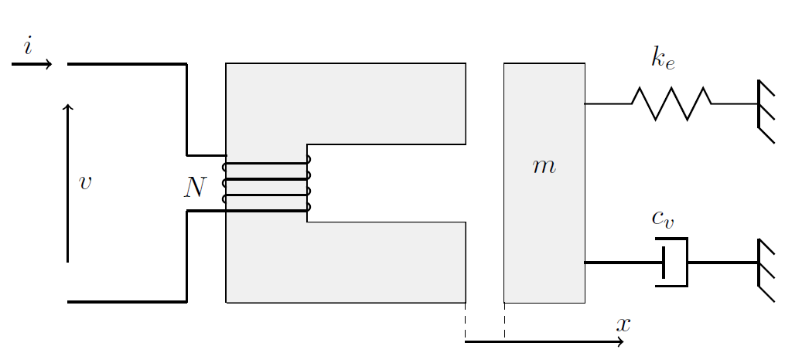

# Electromechanical model
The electro-mechanical system considered consists of:
* a power supply circuit;
* an electromechanical device;
* a system of mechanical loads connected to the moving part.
The system has a single degree of freedom, denoted by x.

The problem is solved by considering the Firestone analogy where:
* the *through* variable: electromagnetic current $i(t)$ &harr; mechanical force $f(t)$;
* the *across* variable: electromagnetic voltage $v(t)$ &harr; mechanical velocity $\dot{x}(t)$.\

According to these conventions:
* the mass is represented by a capacitor;
* the spring is represented by an inductor;
* viscous friction is represented by a resistor.\

In  general, the study of an electromechanical system requires the calculation of:
* $\lambda(i, x)$: the magnetic flux linked to the winding as a function of position $x$ and supply current
i. In static conditions, i.e., in the absence of parasitic currents, this characteristic can be
calculated through a series of magnetostatic field analyses at different values of $i$ and $x$. The characteristic may be nonlinear with respect to x due to geometry, and nonlinear with respect
to i in the presence of ferromagnetic materials.
* $F(i, x)$: the force exerted on the moving element by the magnetic field. Again, in static
conditions, the force characteristic can be calculated through magnetostatic field analysis. In
the presence of reluctance forces, the characteristic becomes quadratic with respect to i, while
in the presence of permanent magnets, it has a linear dependence on the current. However,
saturation of the ferromagnetic material can also modify the force characteristic.\

Once the characteristic  $\lambda(i, x)$ is determined, the electromagnetic induction terms related to its temporal variation can be evaluated. In the electromechanical case, the term  $d\lambda/dt$ depends on two effects:
* *Transformer effect*: modification of $\lambda$ due to temporal variations of the supply quantities, assuming the system to be static from the mechanical point of view.
* *Motion effect*: modification of $\lambda$ due to variations in the position of the magnetic system under constant supply conditions.

The problem is solved in Python considering the state-space formulation of the problem. While in Simulink the resolution is divided in three subsystems: the magnetic, the electrical and the mechanical one. Both the analyses give the same results. \
Afterwards, it considered to have tabular values of force and magnetic flux as input at the variation of $x$ and $i$. Through the use of $2-D$ $Lookup$ $Table$ blocks the problem is solved in Simulink.

